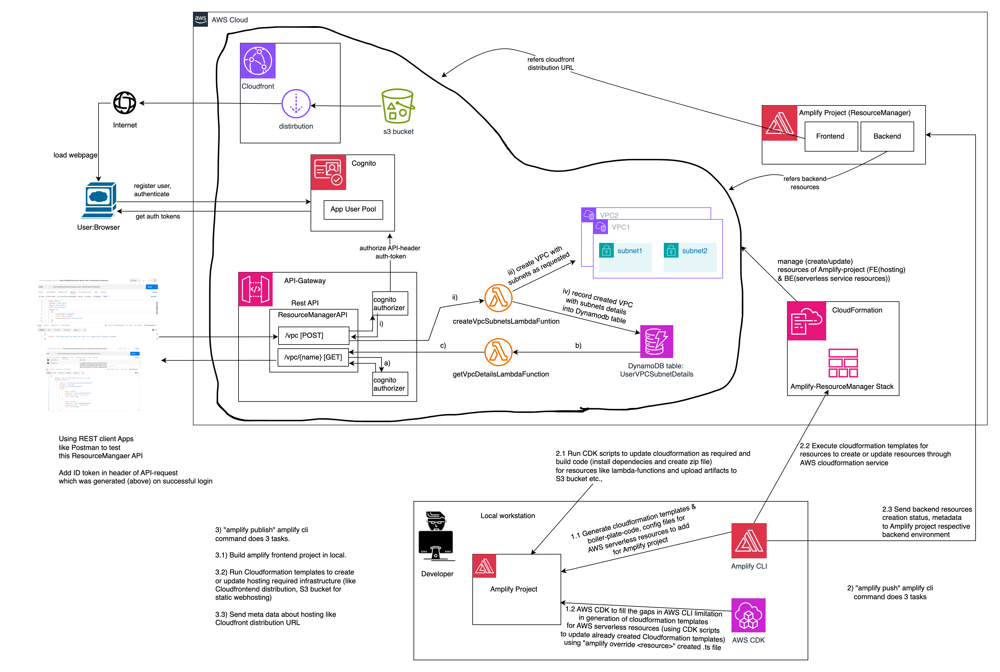
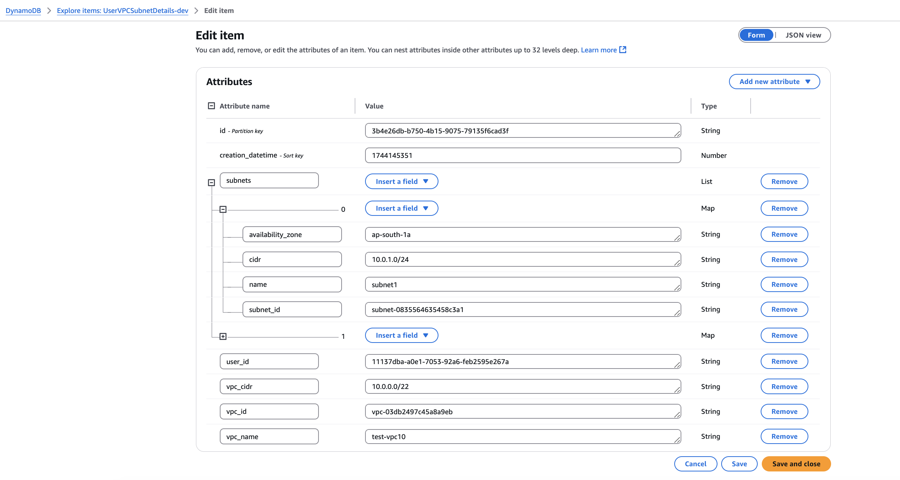
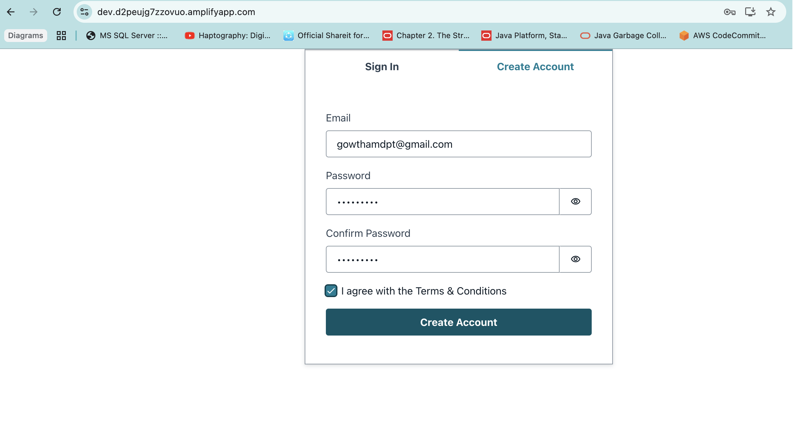
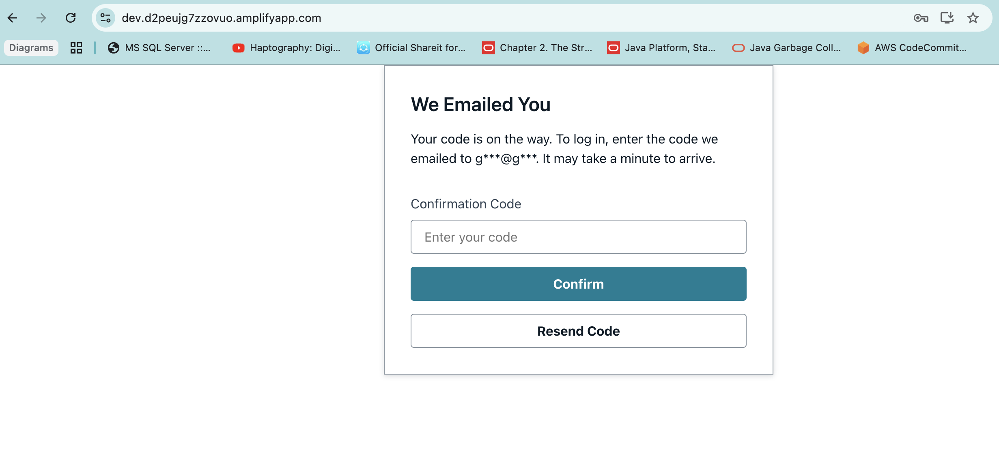
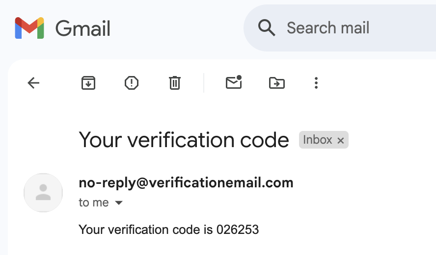
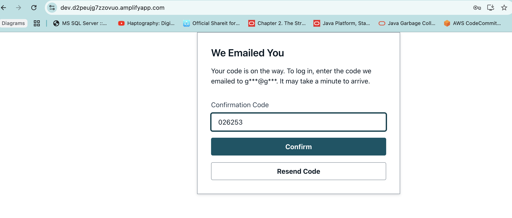
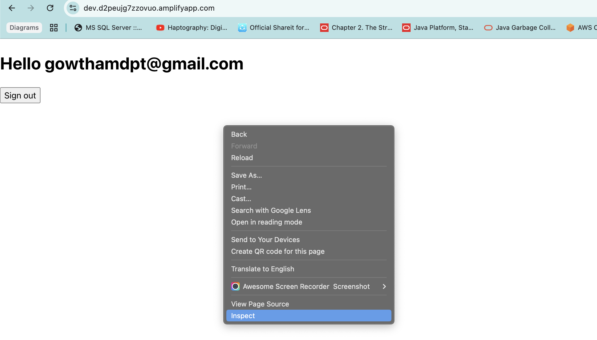
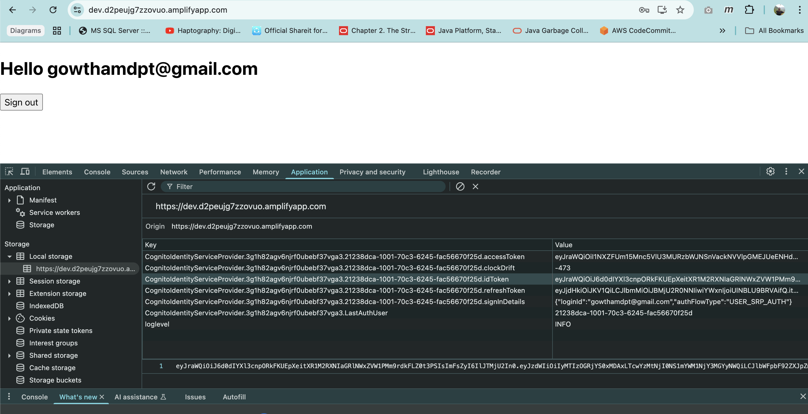
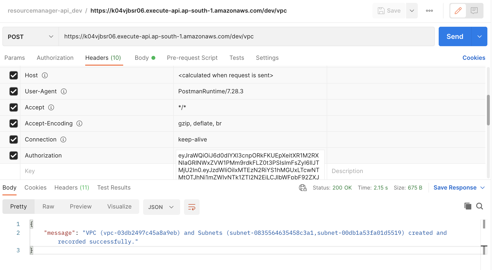
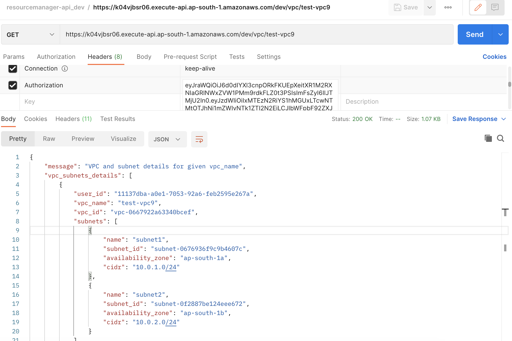

# Table of Contents

1. [About the Project](#1-about-the-project)
2. [Workflow Diagram](#2-workflow-diagram)
3. [Key Project Features](#3-key-project-features)
4. [Prerequisites](#4-prerequisites)
5. [Clone & Configure Amplify Project](#5-clone--configure-amplify-project)
6. [Deploy Backend Resources and Host Frontend](#6-deploy-backend-resources-and-host-frontend)
7. [Useful Amplify CLI Commands](#7-useful-amplify-cli-commands)
8. [Directory Structure](#8-directory-structure)
9. [DynamoDB Table: UserVPCSubnetDetails Structure](#9-dynamodb-table-uservpcsubnetdetails-structure)
10. [Example Request and Response for Create VPC & Subnets API Endpoint](#10-example-request-and-response-for-create-vpc--subnets-api-endpoint)
11. [Example Request and Response for Get VPC & Subnets Details API Endpoint](#11-example-request-and-response-for-get-vpc--subnets-details-api-endpoint)
12. [Deployed Amplify Application Details](#12-deployed-amplify-application-frontend-app-and-backend-api-details)
13. [Testing API Endpoints](#13-testing-api-endpoints)

### 1. About the Project:

This project implements a serverless REST API with integrated authentication. It allows users to create a Virtual Private Cloud (VPC) along with its subnets based on provided specifications, and then stores the resulting VPC ID and subnet IDs in a database. Additionally, it offers an endpoint to retrieve the saved details of the VPC and its subnets.

---

### 2. Workflow Diagram



---

### 3. Key Project Features

- **AWS Amplify-Based Infrastructure:**  
  This project leverages the AWS Amplify tool to build and manage a complete serverless infrastructure.

- **Serverless Resource Management via Amplify CLI:**  
  Amplify CLI commands are used to add and configure required serverless resources for the project. This includes provisioning backend services (e.g., AWS Lambda functions, API Gateway endpoints, Cognito authentication) through automated CloudFormation templates.

- **Custom Overrides with AWS CDK:**  
  To enable features not yet supported natively by the Amplify CLI—such as incorporating a Cognito authorizer for a REST API integrated with AWS Lambda—the project uses an override file (e.g., `override.ts`). This file leverages AWS CDK to modify the CloudFormation templates generated by Amplify CLI.

- **Comprehensive Project Initialization:**  
  When initializing the project, the Amplify CLI generates all the boilerplate code, CloudFormation templates, and configuration files necessary for both frontend and backend setup. This process lays the foundation for subsequent resource additions.

- **Backend Deployment Workflow:**  
  The deployment process for backend resources involves several steps:  
  - Building and packaging code artifacts (for example, a Lambda function along with its dependencies) locally.  
  - Uploading the resulting package to an S3 bucket.  
  - Updating the CloudFormation stack to create or update the backend resources.  
  - Synchronizing the resource state and metadata to the Amplify project’s backend environment in AWS.

- **Frontend Deployment Workflow:**  
  Amplify CLI commands are also used to build and deploy the frontend application (such as React or Angular). This includes provisioning the infrastructure for hosting the application as static web content on an S3 bucket, optionally served globally via a CloudFront distribution.

- **Built-In Authentication Flows:**  
  The project integrates Cognito authentication screens for a complete user authentication experience. This includes:
  - User registration and verification.
  - Login, which generates an ID token, refresh token, and access token.
  - These tokens are used in REST API requests and validated by API Gateway before invoking the associated Lambda functions.

---

### 4. Prerequisites

- **Node.js (v20.x):**  
  Ensure Node.js version 20.x is installed. You can download it from [nodejs.org](https://nodejs.org). This version should come with npm version 10.x.

- **npm (v10.x):**  
  Verify that your npm version is 10.x:
  ```bash
  npm --version
  ```

- **Python (v3.12):**  
  Ensure Python version 3.12 is installed. Download it from [python.org](https://www.python.org/downloads/).

- **AWS Account:**  
  An active AWS account with the necessary permissions to create and manage resources such as Lambda functions, API Gateway, Cognito, and S3.

- **AWS CLI:**  
  Install the AWS Command Line Interface and configure it with your AWS credentials:
  ```bash
  aws configure
  ```

- **AWS Amplify CLI:**  
  Install the Amplify CLI globally:
  ```bash
  npm install -g @aws-amplify/cli
  ```

- **IAM User with Sufficient Permissions:**  
  Set up or use an existing IAM user with the required permissions (e.g., AdministratorAccess or specific fine-grained policies) so that the Amplify CLI can provision AWS resources.

- **AWS Amplify UI Components for React:**  
  Install the Amplify UI library for React to integrate authentication screens and other UI elements:
  ```bash
  npm install --save aws-amplify @aws-amplify/ui-react
  ```

- **Code Editor:**  
  A code editor (e.g., Visual Studio Code) is recommended for editing project files and configurations.

---

### 5. Clone & Configure Amplify Project

- **Clone the Repository:**  
  Use Git to clone the project repository:
  ```bash
  git clone <repo-link>
  ```

- **Configure the Amplify Project:**  
  Navigate to the project directory and run:
  ```bash
  amplify init
  ```
  This command initializes your Amplify project by setting up the necessary configuration files and linking your local project with an existing (or new) Amplify project in your AWS account. You can also use this step to associate your project with a different AWS account if needed.

---

### 6. Deploy Backend Resources and Host Frontend

- **Deploy Backend Resources:**  
  At the project root directory, execute:
  ```bash
  amplify push
  ```
  This command builds and packages your backend code, creates or updates CloudFormation stacks, and deploys the configured AWS resources to your cloud environment. It ensures that any local changes are synchronized with your Amplify project's backend in AWS.

- **Host and Deploy the Frontend Application:**  
  Run:
  ```bash
  amplify publish
  ```
  This command builds your frontend (e.g., React) application, updates the hosting infrastructure (such as the S3 bucket and CloudFront distribution if configured), and deploys your static assets to AWS. It automates the process of preparing and delivering your web application to users.

---

### 7. Useful Amplify CLI Commands

| Command                       | Description                                                                         |
|------------------------------|-------------------------------------------------------------------------------------|
| `amplify init`               | Initializes a new Amplify project in the current directory.                        |
| `amplify add auth`           | Adds Amazon Cognito authentication to the project.                                 |
| `amplify add api`            | Adds an API (REST via API Gateway or GraphQL via AppSync) to the project.          |
| `amplify add storage`        | Adds S3-based storage (for user files) to the project.                             |
| `amplify add function`       | Adds a Lambda function to the project.                                             |
| `amplify push`               | Provisions or updates resources in AWS via CloudFormation.                         |
| `amplify publish`            | Builds and deploys your frontend to Amplify hosting (S3/CloudFront).              |
| `amplify status`             | Shows status of local changes vs. deployed resources.                              |
| `amplify env add`            | Creates a new environment (e.g., dev, test, prod).                                 |
| `amplify env checkout`       | Switches to an existing environment.                                               |
| `amplify pull`               | Syncs local configurations with the remote Amplify environment.                   |
| `amplify console`            | Opens the Amplify Console in your browser.                                         |

---

### 8. Directory Structure

A typical layout for this project might look like:

```
amplify-project-resource-manager/
├─ src/                          # React application source code
│  ├─ components/
│  ├─ pages/
│  └─ App.js
├─ public/                       # Public assets (favicon, index.html, etc.)
├─ amplify/
│  ├─ backend/
│  │  ├─ function/
│  │  │  └─ createVpcSubnetsLambdaFuntion/
│  │  │     └─ src/
│  │  │  └─ getVpcDetailsLambdaFunction/
│  │  │     └─ src/
│  │  ├─ auth/
│  │  ├─ api/
│  │  └─ storage/
|  |  └─ hosting/
│  ├─ # Additional Amplify configuration files (team-provider-info.json, etc.)
├─ package.json
├─ README.md                     # This file
└─ AmplifyProject_ResourceManager_WorkflowDiagram.drawio.png
```

---

### 9. DynamoDB Table: UserVPCSubnetDetails Structure

The **UserVPCSubnetDetails** table is designed to store details about user-created VPCs and their associated subnets. It uses both primary keys and Global Secondary Indexes (GSIs) to enable efficient querying based on different attributes.

#### Table Attributes

- **id (String):**  
  - **Role:** Partition Key  
  - **Description:** A unique identifier for each record generated as a UUID.

- **creation_datetime (Number):**  
  - **Role:** Sort Key  
  - **Description:** Timestamp indicating when the record was created.

- **subnets (List):**  
  - **Description:** A list containing details about the subnets associated with the VPC.

- **user_id (String):**  
  - **Usage:** Included in a Global Secondary Index  
  - **Description:** Identifier for the user who created the VPC.

- **vpc_name (String):**  
  - **Usage:** Included in a Global Secondary Index  
  - **Description:** The name assigned to the VPC.

#### Global Secondary Indexes (GSIs)

Two GSIs are defined to facilitate efficient querying based on either the user or the VPC name:

1. **user_id-creation_datetime-index**
   - **Partition Key:** `user_id` (String)
   - **Sort Key:** `creation_datetime` (Number)
   - **Purpose:** Enables queries for all VPC details associated with a specific user, ordered by creation time.

2. **vpc_name-creation_datetime-index**
   - **Partition Key:** `vpc_name` (String)
   - **Sort Key:** `creation_datetime` (Number)
   - **Purpose:** Allows querying for VPC details based on the VPC name, sorted by the creation time.

#### Example Item in DynamoDB Table UserVPCSubnetDetails



---

### 10. Example Request and Response for Create VPC & Subnets API Endpoint

#### Request

- **Method:** `POST`
- **URL:** `https://k04vjbsr06.execute-api.ap-south-1.amazonaws.com/dev/vpc`
- **Headers:**  
  - **Authorization:** `{cognito-auth generated id-token}`

- **Body:**

  ```json
  {
    "vpcName": "test-vpc10",
    "region": "ap-south-1",
    "cidr": "10.0.0.0/22",
    "subnets": [
      {
        "subnetName": "subnet1",
        "cidr": "10.0.1.0/24",
        "availabilityZone": "ap-south-1a"
      },
      {
        "subnetName": "subnet2",
        "cidr": "10.0.2.0/24",
        "availabilityZone": "ap-south-1b"
      }
    ]
  }
  ```

#### Response

- **HTTP Status Code:** `200`
- **Body:**

  ```json
  {
    "message": "VPC (vpc-03db2497c45a8a9eb) and Subnets (subnet-0835564635458c3a1,subnet-00db1a53fa01d5519) created and recorded successfully."
  }
  ```

---

### 11. Example Request and Response for Get VPC & Subnets Details API Endpoint

#### Request

- **Method:** `GET`
- **URL:** `https://k04vjbsr06.execute-api.ap-south-1.amazonaws.com/dev/vpc/{name}`
  - Replace `{name}` with the VPC name (e.g., `test-vpc9`).
- **Headers:**  
  - **Authorization:** `{cognito-auth generated id-token}`

#### Response

- **HTTP Status Code:** `200`
- **Body:**

  ```json
  {
    "message": "VPC and subnet details for given vpc_name",
    "vpc_subnets_details": [
      {
        "user_id": "11137dba-a0e1-7053-92a6-feb2595e267a",
        "vpc_name": "test-vpc9",
        "vpc_id": "vpc-0667922a63340bcef",
        "subnets": [
          {
            "name": "subnet1",
            "subnet_id": "subnet-0676936f9c9b4607c",
            "availability_zone": "ap-south-1a",
            "cidr": "10.0.1.0/24"
          },
          {
            "name": "subnet2",
            "subnet_id": "subnet-0f2887be124eee672",
            "availability_zone": "ap-south-1b",
            "cidr": "10.0.2.0/24"
          }
        ],
        "vpc_cidr": "10.0.0.0/22",
        "id": "b4fc1b6f-5cb0-4cfb-bfbf-067381a889a6",
        "creation_datetime": 1744087450.0
      }
    ]
  }
  ```

---

### 12. Deployed Amplify application (Frontend app and Backend API) details:

- **Backend API details:**
  Click on below link to download postman-collection zip file, extract it to get .json file and import into postman to view collection with two example rest-api endpoints requests and responses.

  <a href="./resourcemanager-api_dev.postman_collection.zip" download>Download Rest API Postman Collection</a>

- **Frontend Application details:***

  URL to access hosted frontend application : https://dev.d2peujg7zzovuo.amplifyapp.com/

---

### 13. Testing API endpoints

- Follow the screenshots to register new user, verify user-email, login successfully to generate auth-tokens. Copy ID-token from browser inspect page -> Application tab -> Storage -> Local storage -> select FE app URL : then right side you can see generated cognito-auth-tokens.
- Use this ID-token in header of API request as value to the Authorization key.
















